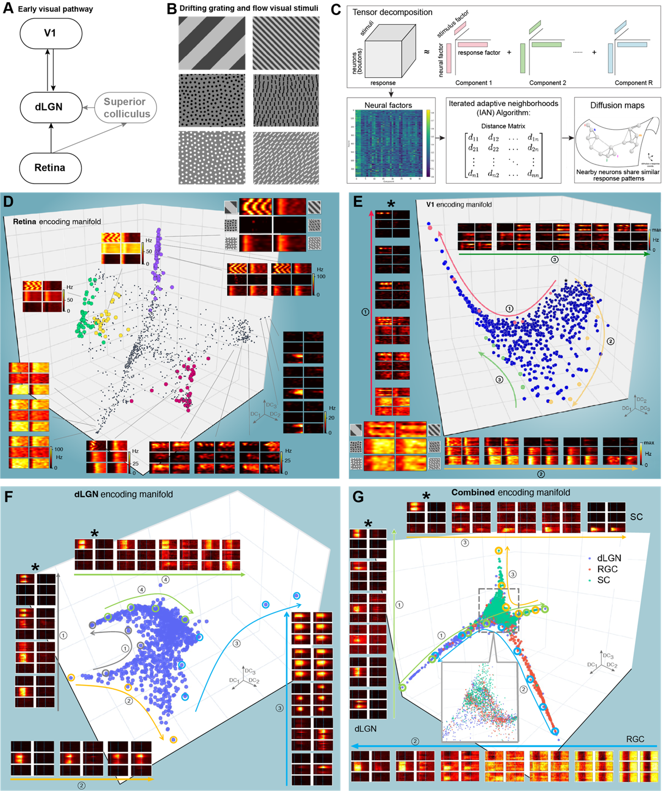
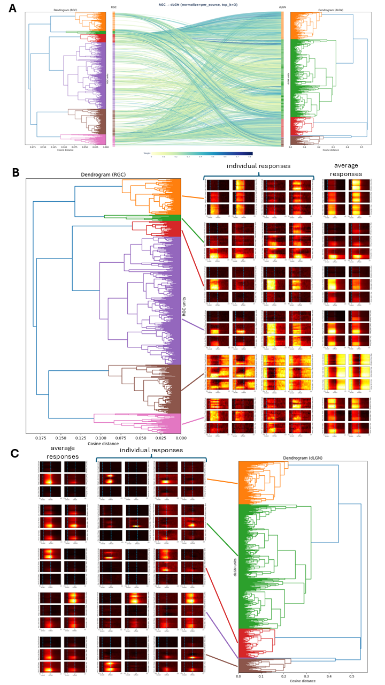

# Neural Encoding Manifolds – Highlights

## Population encoding of visual features along the retina-dLGN-V1 visual hierarchy

**Figure 1. Population encoding of visual features along the retina-dLGN-V1 visual hierarchy.**  
(A) The early visual pathway. (B) Visual stimuli. (C) Schematic of the encoding manifold algorithm. 
(D-E) Retina and V1 encoding manifold with response maps from example neurons. Adapted from *Luciano et. al. 2024*. 
(F) Preliminary results of the dLGN encoding manifold. 
(G) Preliminary results of a combined encoding manifold including RGC input, SC input, and dLGN neurons.  
(dLGN: dorsal lateral geniculate nucleus; RGC: retinal ganglion cell; SC: superior colliculus; V1: primary visual cortex)

---

## Mapping and response structure of RGC and dLGN neurons

**Figure 2. Mapping and response structure of RGC and dLGN neurons.**  
(A) Mapping from RGC inputs to dLGN neurons using LASSO-regularized fitting.
(B) Clustering of RGC response patterns, showing individual responses and cluster-averaged responses.
(C) Clustering of dLGN response patterns, showing individual responses and cluster-averaged responses.
